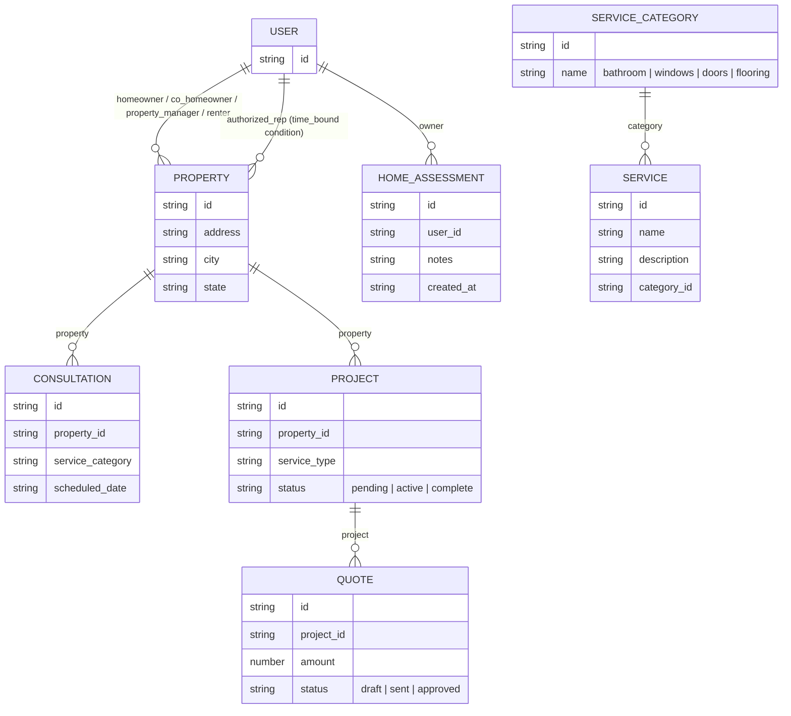
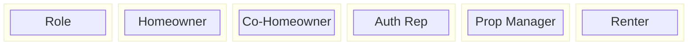
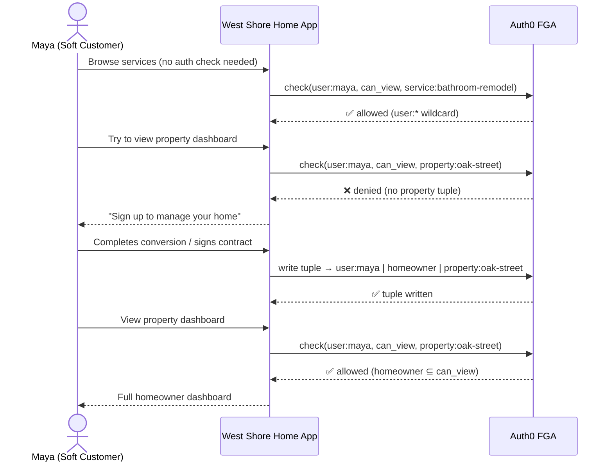
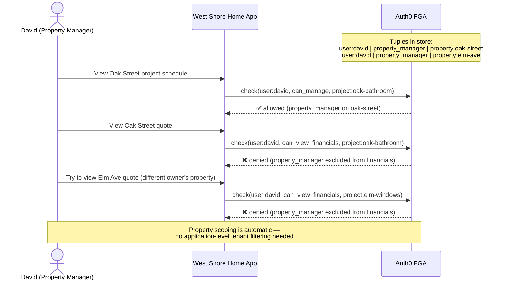
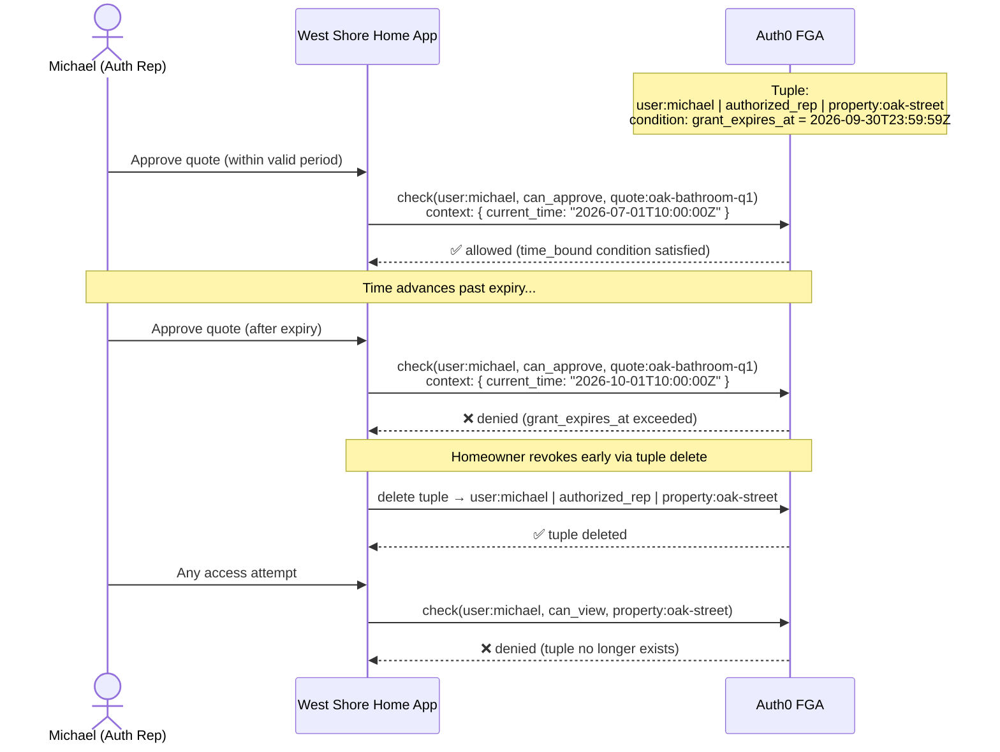

# West Shore Home — FGA Data Model Diagrams

---

## 1. Entity Relationship & Relation Traversal

How FGA types relate to one another. Arrows show `define X: [Y]` (direct) or `from` traversals (computed).

---

## 2. Property Role Permissions Matrix

Which roles can perform which actions on a property and its resources.

> The table below maps FGA computed permissions to each property role.

| Permission | Homeowner | Co-Homeowner | Auth Rep | Prop Manager | Renter |
|---|:---:|:---:|:---:|:---:|:---:|
| `can_view` (property/project/consult) | ✅ | ✅ | ✅ | ✅ | ✅ |
| `can_book_consultation` | ✅ | ✅ | ✅ | ✅ | ❌ |
| `can_manage` (project scheduling) | ✅ | ✅ | ✅ | ✅ | ❌ |
| `can_view_financials` (quotes) | ✅ | ✅ | ✅ | ❌ | ❌ |
| `can_approve_work` (authorize project) | ✅ | ✅ | ✅ | ❌ | ❌ |
| `can_cancel_project` | ✅ | ❌ | ✅ | ❌ | ❌ |
| `can_manage_users` (add/remove roles) | ✅ | ❌ | ❌ | ❌ | ❌ |
| `can_delete` (close account) | ✅ | ❌ | ❌ | ❌ | ❌ |

> **Auth Rep note:** Tuple carries a `time_bound` condition with `grant_expires_at`. Access auto-denies after expiry even if tuple is not deleted. Revocation = tuple delete.

---

## 3. Soft → Hard Customer Conversion Flow

The moment a soft customer converts, a single FGA tuple write creates the property relationship.

---

## 4. Multi-Property Scoping (David the Property Manager)

Demonstrates that a role on Property A grants zero access to Property B.

---

## 5. Authorized Rep Temporal Access

Time-bound delegation with condition context passed at check time.

